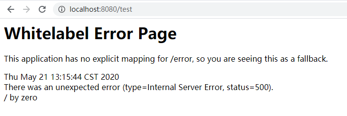
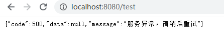

# （六）从零搭建后端框架——异常统一处理的三种方式

## 前言
项目在运行时出现异常时，如若没有对异常进行捕获并处理，就会出现如下页面：



这样显然对用户是及其不友好的。

后端不应该直接返回错误页面，而应返回统一的错误信息，比如：
```json
{
  "code": 500,
  "data": null,
  "message": "服务异常，请稍后重试"
}
```
然后，前端根据返回的信息，显示友好的提示页面。

Spring提供了三种方式对异常统一处理：
1. @ExceptionHandler
2. 实现HandlerExceptionResolver接口
3. @ControllerAdvice + @ExceptionHandler

下面我们来实际操作下。

## 具体实现

### @ExceptionHandler
在[【统一基类、接口、返回对象设计】](https://juejin.im/post/5ec4efed6fb9a047a3272e81)这一篇文章中，
定义了Controller的基类BaseController，所以只要在BaseController中使用@ExceptionHandler处理异常，
其它Controller继承BaseController即可。实现如下：

```java
@Slf4j
public abstract class BaseController {

    /**
     * BusinessException 异常处理
     */
    @ResponseBody
    @ExceptionHandler(BusinessException.class)
    public ApiResult businessExceptionHandler(BusinessException e) {
        log.error(e.getMessage(), e);
        // do something
        return ApiResult.fail(e.getMessage());
    }

    /**
     * Exception 异常处理
     */
    @ResponseBody
    @ExceptionHandler(Exception.class)
    public ApiResult exceptionHandler(Exception e) {
        log.error(e.getMessage(), e);
        return ApiResult.fail("服务异常，请稍后重试");
    }
}
```
这里对异常BusinessException和Exception进行了处理，
BusinessException是约定的业务异常的基类，若是主动抛出一般都要求是BusinessException的子类，都会被businessExceptionHandler处理。
若是其它异常，可能是意想不到的异常，则会被exceptionHandler处理。

统一处理后，返回结果如下:



### 实现HandlerExceptionResolver接口
```java
@Slf4j
@Component
public class GlobalHandlerExceptionResolver implements HandlerExceptionResolver {

    @Override
    public ModelAndView resolveException(HttpServletRequest request, HttpServletResponse response, Object o, Exception e) {
        log.error(e.getMessage(), e);
        ApiResult apiResult;
        if (e instanceof BusinessException) {
            BusinessException be = (BusinessException) e;
            // do something
            apiResult = ApiResult.fail(be.getMessage());
        } else {
            apiResult = ApiResult.fail("服务异常，请稍后重试");
        }
        WebUtils.writeJson(response, apiResult);
        return null;
    }
}
```
该方式需要实现HandlerExceptionResolver接口，然后将实现类注入到Spring容器中。

但第一种方式中，@ResponseBody注解，Spring就帮我们返回了json格式数据，而这需要自己实现。
这里实现了工具类WebUtils，用于返回json数据，如下：
```java
public class WebUtils {

    private static final Logger log = LoggerFactory.getLogger(WebUtils.class);

    private static Gson gson = new GsonBuilder().serializeNulls().create();

    /**
     * 返回json数据
     *
     * @param response
     * @param object
     */
    public static void writeJson(HttpServletResponse response, int status, Object object) {
        response.setHeader("Content-Type", "application/json;charset=UTF-8");
        response.setContentType("application/json;charset=UTF-8");
        response.setStatus(status);
        PrintWriter out = null;
        try {
            String data = object instanceof String ? (String) object : gson.toJson(object);
            out = response.getWriter();
            out.print(data);
            out.flush();
        } catch (Exception e) {
            log.error(e.getMessage(), e);
        } finally {
            if (out != null) {
                out.close();
            }
        }
    }

    /**
     * 返回json数据
     *
     * @param response
     * @param object
     */
    public static void writeJson(HttpServletResponse response, Object object) {
        writeJson(response, HttpServletResponse.SC_OK, object);
    }

    /**
     * 返回json数据
     *
     * @param response
     * @param object
     */
    public static void writeJson(ServletResponse response, Object object) {
        if (response instanceof HttpServletResponse) {
            writeJson((HttpServletResponse) response, object);
        }
    }
}
```

工具类中使用了Gson，需要引用：
```xml
<dependency>
    <groupId>com.google.code.gson</groupId>
    <artifactId>gson</artifactId>
</dependency>
```

### @ControllerAdvice + @ExceptionHandler
该方式与第一种方式类似，如下：
```java
@Slf4j
@ControllerAdvice
public class GlobalExceptionHandler {

    /**
     * BusinessException 异常处理
     */
    @ResponseBody
    @ExceptionHandler(BusinessException.class)
    public ApiResult businessExceptionHandler(BusinessException e) {
        log.error(e.getMessage(), e);
        // do something
        return ApiResult.fail(e.getMessage());
    }

    /**
     * Exception 异常处理
     */
    @ResponseBody
    @ExceptionHandler(Exception.class)
    public ApiResult exceptionHandler(Exception e) {
        log.error(e.getMessage(), e);
        return ApiResult.fail("服务异常，请稍后重试");
    }
}
```

## 总结
三种方式都能很好对异常进行统一处理，但是一般推荐使用@ControllerAdvice + @ExceptionHandler方式，
这样能够使异常处理与业务逻辑分离，并且不用自己处理Json数据返回。

## 源码
[https://github.com/zhuqianchang/framework](https://github.com/zhuqianchang/framework)

## 往期回顾
* [（一）从零搭建后端框架——构建SpringBoot项目](https://juejin.im/post/5ebe51d3f265da7bae2fae7b)
* [（二）从零搭建后端框架——SpringBoot自定义Banner](https://juejin.im/post/5ebf40785188256d514786ec)
* [（三）从零搭建后端框架——SpringBoot集成Swagger2](https://juejin.im/post/5ec1fae45188256d5b4db007)
* [（四）从零搭建后端框架——SpringBoot集成Lombok](https://juejin.im/post/5ec39b6d6fb9a047dd28c5f5)
* [（五）从零搭建后端框架——统一基类、接口、返回对象设计](https://juejin.im/post/5ec4efed6fb9a047a3272e81)